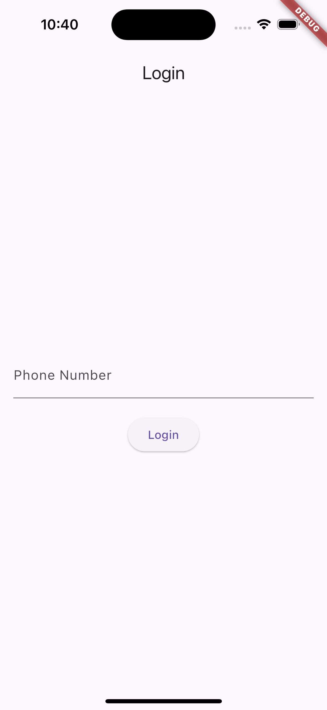
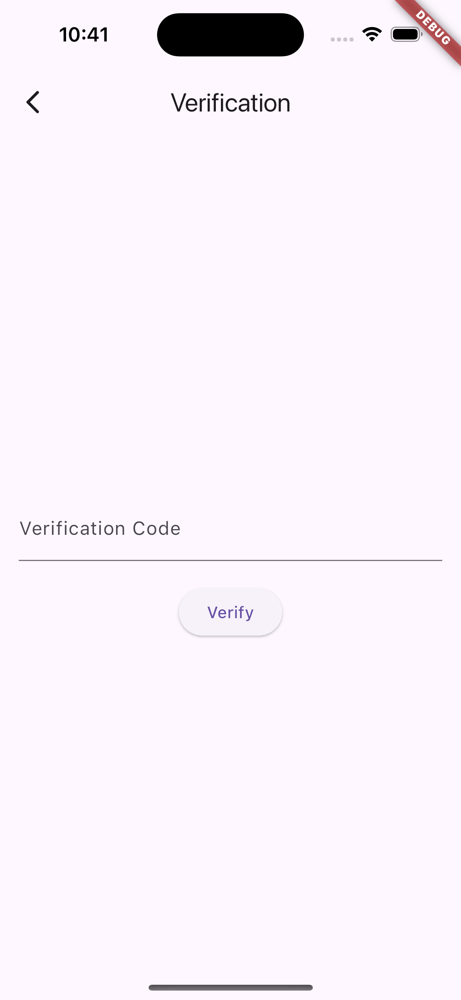
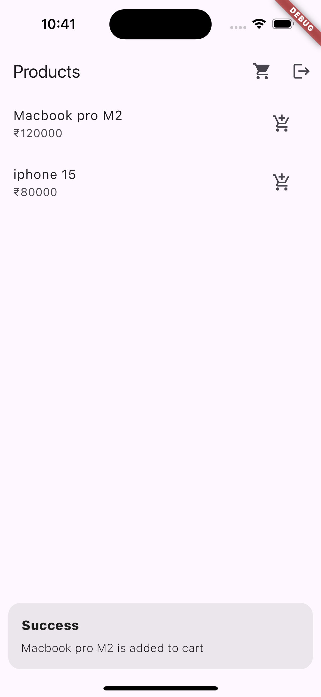
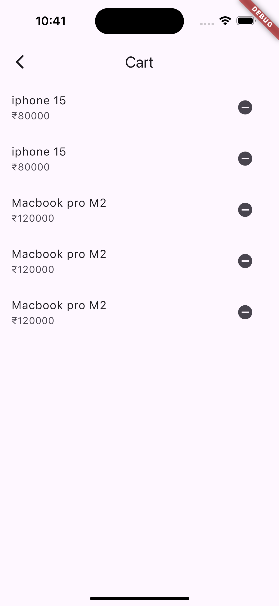
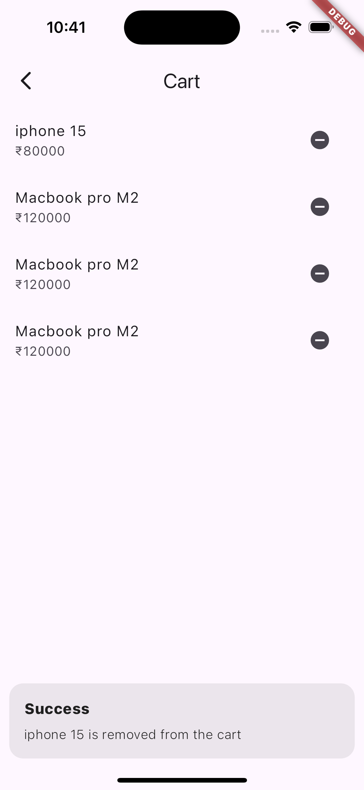

# Fire Ecomm

Fire Ecomm is a Flutter-based e-commerce application that integrates with Firebase for authentication, data storage, and more. The app uses the GetX package for state management and GetStorage for local storage.

## Features

- Phone number authentication with Firebase
- Product listing from Firebase Firestore
- Add products to cart
- Save user and cart information in Firebase Firestore
- Persistent login using GetStorage
- Logout functionality
- Clean and maintainable code structure following MVVM architecture

|  |  |
|------------------------------------------|------------------------------------------------------------|
|  |  |
|------------------------------------------|------------------------------------------------------------|
|  | |  |
|

## Prerequisites

- Flutter SDK
- Firebase project with Firestore and Authentication enabled
- Android Studio or Xcode

## Project Structure

The project follows a clean and organized structure to enhance maintainability and scalability:

### Directory Breakdown:

- `bindings/`: Contains dependency injection setup.
  - `initial_binding.dart`: Initializes dependencies for the app.

- `controllers/`: Manages the application's business logic.
  - `auth_controller.dart`: Handles authentication-related operations.
  - `cart_controller.dart`: Manages cart functionalities.
  - `product_controller.dart`: Controls product-related operations.

- `models/`: Defines data structures used in the app.
  - `product_model.dart`: Represents the product entity.
  - `user_model.dart`: Represents the user entity.

- `services/`: Implements external service integrations.
  - `firebase_service.dart`: Manages Firebase-related operations.

- `views/`: Contains the UI components of the application.
  - `cart_page.dart`: Displays the shopping cart.
  - `login_page.dart`: Handles user login.
  - `product_page.dart`: Shows product listings.
  - `verification_page.dart`: Manages OTP verification.

- `main.dart`: The entry point of the application.

This structure follows the MVC  architecture, separating concerns and improving code organization.

## Additional Resources

If you're new to Flutter development, here are some resources to get you started:

- [Lab: Write your first Flutter app](https://docs.flutter.dev/get-started/codelab)
- [Cookbook: Useful Flutter samples](https://docs.flutter.dev/cookbook)

For comprehensive guidance on Flutter development, check out the [online documentation](https://docs.flutter.dev/). It provides tutorials, samples, guidance on mobile development, and a full API reference.

## Contributing

We welcome contributions to improve Fire Ecomm! If you'd like to contribute, please follow these steps:

1. Fork the repository
2. Create a new branch for your feature or bug fix
3. Make your changes and commit them with clear, descriptive messages
4. Push your changes to your fork
5. Submit a pull request to the main repository

For major changes or new features, please open an issue first to discuss what you would like to change.

Please make sure to update tests as appropriate and adhere to the project's coding standards.

## License

This project is licensed under the MIT License. See the [LICENSE](LICENSE) file for full details.

The MIT License is a permissive license that allows for reuse of the software with minimal restrictions. It permits use, modification, and distribution of the code for both private and commercial purposes, as long as the original copyright and license notice are included.